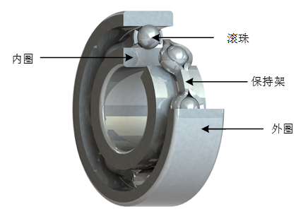
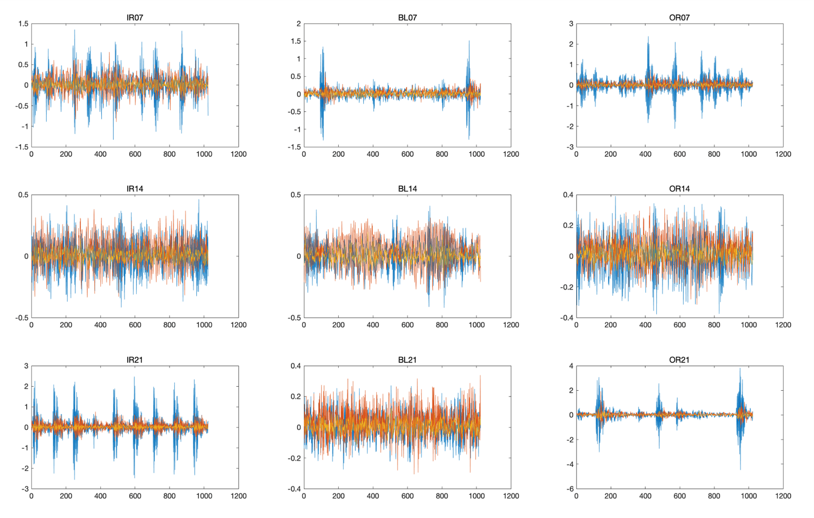
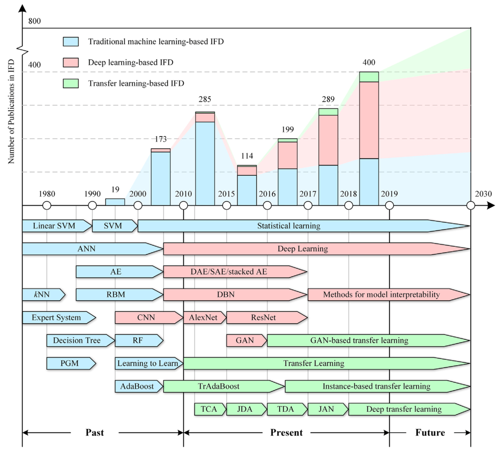

## 问题背景

<figure>
<center>

</center>
</figure>

本文为人工智能课程设计的第二道题目轴承故障诊断。滚动轴承的机械结构如图所示，滚动轴承的局部故障可能发生在外圈、内圈、保持架或滚珠中。当滚珠撞击外圈或内圈上的局部故障，或者滚珠上的故障撞击外圈或内圈时，会激发轴承和响应传感器之间的高频共振，采集轴承的振动信号就可以实现故障的诊断。轴承存在3种故障：外圈故障，内圈故障，滚珠故障，结合轴承的3种直径，轴承的故障类型共有9类。课程设计的问题限定为负载条件为3HP，转速约为1730，包括以下9种故障。

<div class="center">

| |半径7|半径14|半径21|
|:-|:-:|:-:|:-:|
|内圈|IR07|IR14|IR21
|滚珠体|BL07|BL14|BL21
|外圈|OR07|OR14|OR21

</div>

## 数据

训练数据包含了九种故障的时序信号，如下图所示。
<figure>

</figure>

数据储存在[mat文件](./data/Fault_Diag_Data.mat)中，为了处理方便，使用matlab通过[如下方式](./code/get_csv.m)将其转存为csv文件。

```matlab
load('data/Fault_Diag_Data.mat')
for i=1:9
writetable(TrainData{i}.data,['data/',TrainData{i}.label,'.csv'])
end
```

## 方法

在轴承故障诊断领域，常用的方法包括传统机器学习方法和深度学习方法等，传统机器学习方法一般包括特征提取和模式分类两部分，常见的特征提取算法有快速傅里叶变化，小波变换，经验模式分解以及信号的统计学特征等，常见的模式分类算法有支持向量机，BP神经网络(也称为多层感知器)，贝叶斯分类器以及最近邻分类器等。基于深度学习的故障诊断方法一般包括卷积神经网络，对抗神经网络等方法。近年来，有关迁移学习方面的研究也逐渐成为故障诊断的热点，如下图所示。
<figure>

</figure>

## 内容说明
code文件夹中各个文件的用途如下所示
```
get_csv.m用于训练数据提取至csv中用于模型的训练，
```
```
demo.ipynb为演示所用代码，其中所有代码均在其他文件中体现，仅作为演示用
```
```
cnn_net.pth为保存的模型
```
```
cnn_model中为基于pytorch搭建的一维卷积神经网络
```
```
fault_diag_utils为部分工具函数
```
```
train为模型的训练过程，以及验证集准确率，训练结果保存为cnn_net.pth
```
```
test为原无标签测试数据的标签生成过程
```